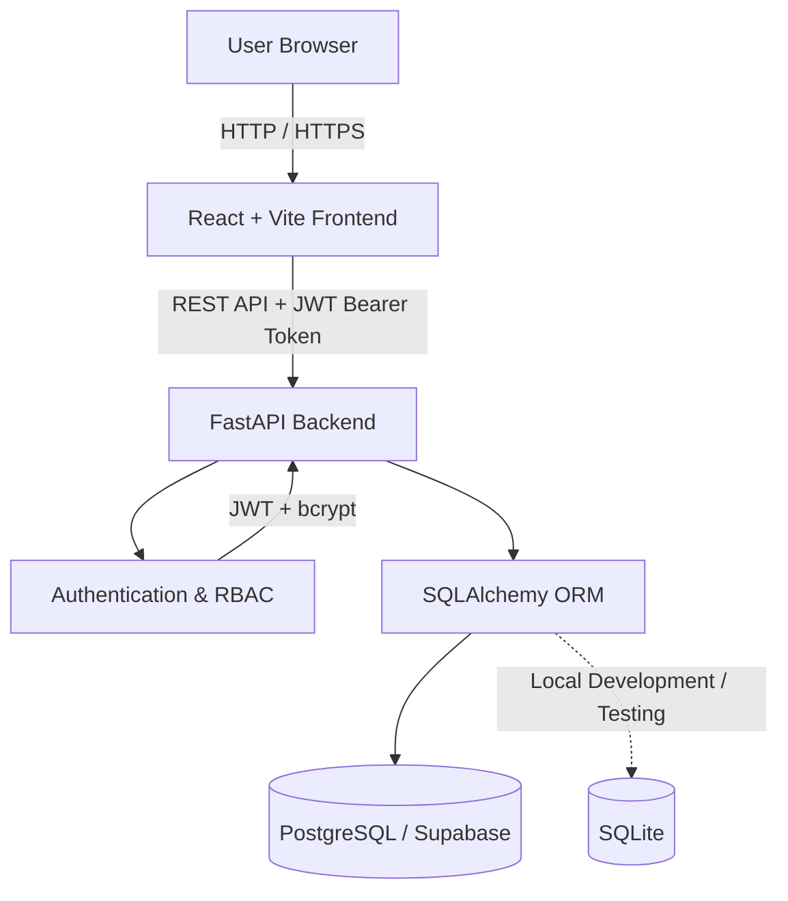
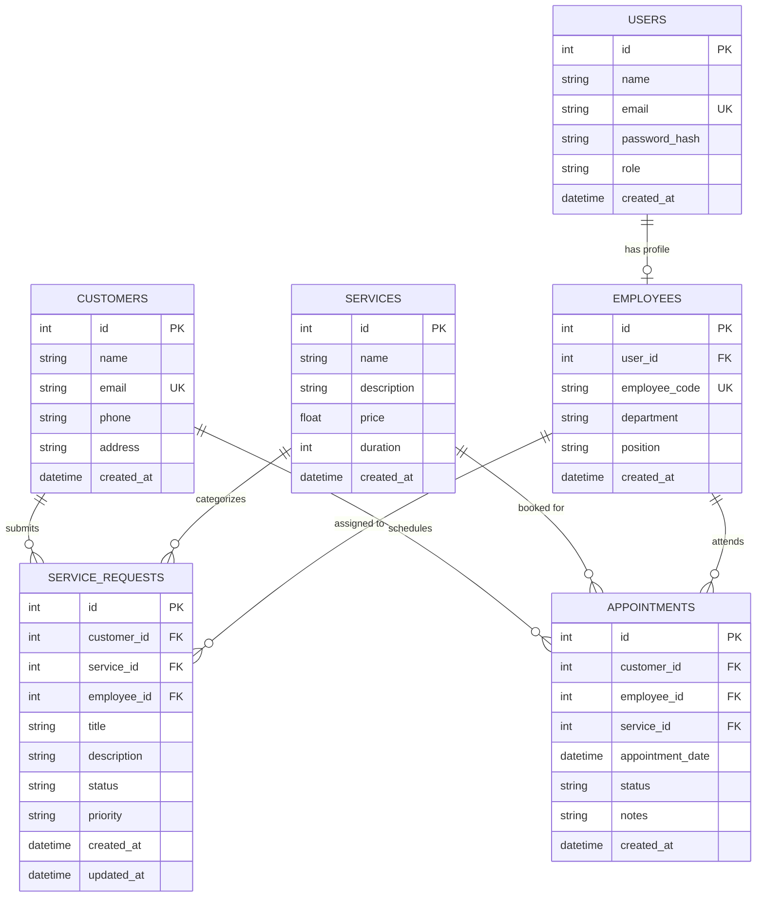
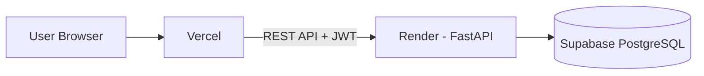

# ServiceHub

> **Service requests. Assigned. Tracked. Completed.**

ServiceHub is a full-stack business management SaaS application designed
for small service-based businesses. It centralizes the operational
workflow from customer requests to employee assignment, appointments,
and completion.

The project combines a **React + Vite frontend**, **FastAPI REST API**,
**PostgreSQL/Supabase database**, **JWT authentication**, **role-based
access control**, and a **Neo-Brutalist UI system**.

------------------------------------------------------------------------

## ✨ Overview

Service-based businesses often manage customers, service requests,
employees, appointments, and operational metrics across disconnected
tools.

ServiceHub brings these workflows into one system:

``` text
Customer
   ↓
Service Request
   ↓
Assignment
   ↓
Employee
   ↓
Appointment
   ↓
Completion
   ↓
Analytics
```

### Product workflow

ServiceHub models the operational lifecycle of a service business:

```text
Customer → Service Request → Assignment → Employee → Appointment → Completion → Analytics
```

This workflow connects operational records with role-specific access and
database-driven business metrics.

### Core capabilities

-   Secure JWT-based authentication
-   Role-Based Access Control (RBAC)
-   Customer management
-   Employee management
-   Service catalog management
-   Service request lifecycle management
-   Employee assignment
-   Appointment scheduling
-   Business analytics dashboard
-   PostgreSQL/Supabase integration
-   SQLite fallback for local development/testing
-   RESTful API architecture
-   Automated backend and E2E testing
-   Docker-based development/deployment
-   Responsive Neo-Brutalist interface

------------------------------------------------------------------------

## 🎯 Project Goals

ServiceHub was built as a realistic full-stack business application,
with an emphasis on clear architecture, secure authorization, relational
data modeling, testing, and deployability.

The main goals are:

1.  Build a clean separation between frontend, backend, authentication,
    and database layers.
2.  Implement secure role-based authorization.
3.  Model a realistic business workflow using relational database
    relationships.
4.  Provide a dashboard driven by real database data rather than
    hard-coded metrics.
5.  Build an interface with a consistent visual design system.
6.  Make the application testable and deployable.

------------------------------------------------------------------------

## 🏗️ System Architecture



### Architecture layers

  -----------------------------------------------------------------------
  Layer                   Technology              Responsibility
  ----------------------- ----------------------- -----------------------
  Frontend                React, Vite, Tailwind   UI and client-side
                          CSS                     application

  Routing                 React Router            Page and route
                                                  management

  HTTP Client             Axios                   API communication

  Backend                 FastAPI                 REST API and business
                                                  logic

  Validation              Pydantic v2             Request/response
                                                  validation

  ORM                     SQLAlchemy 2.0          Database interaction

  Authentication          JWT + bcrypt            Authentication and
                                                  password security

  Database                PostgreSQL / Supabase   Persistent application
                                                  data

  Testing                 Pytest + Playwright     Backend and E2E testing

  Deployment              Docker, Nginx,       Containerization and
                                                  deployment
  -----------------------------------------------------------------------

------------------------------------------------------------------------

## 🗄️ Database Design

The application uses a relational data model centered around customers,
employees, services, requests, and appointments.



### Request lifecycle

``` text
PENDING
   ↓
ASSIGNED
   ↓
IN_PROGRESS
   ↓
COMPLETED
```

A request can also be moved to:

``` text
CANCELLED
```

### Request priorities

-   `LOW`
-   `MEDIUM`
-   `HIGH`
-   `URGENT`

------------------------------------------------------------------------

## 🔐 Authentication & Authorization

ServiceHub uses **JWT bearer authentication** combined with **role-based
access control**.

### Login flow

``` text
User
 ↓
POST /api/auth/login
 ↓
Credential validation
 ↓
Password hash verification
 ↓
JWT generated
 ↓
Frontend stores authentication state
 ↓
JWT sent with protected API requests
 ↓
FastAPI validates token
 ↓
RBAC checks user role
 ↓
Request allowed / rejected
```

### Roles

#### ADMIN

Administrators can manage the core business data:

-   Customers
-   Employees
-   Services
-   Service requests
-   Appointments
-   Analytics

#### EMPLOYEE

Employees have access to operational information relevant to their work:

-   Assigned service requests
-   Related customer information
-   Request status updates
-   Appointments

Unauthorized operations return:

``` text
HTTP 403 Forbidden
```

------------------------------------------------------------------------

## 🎨 Design System

ServiceHub uses a custom **Neo-Brutalist** visual language.

### Visual principles

-   High-contrast interface
-   Heavy borders
-   Hard offset shadows
-   Sharp corners
-   Strong typography
-   Bold status indicators
-   Minimal decorative UI
-   Clear action hierarchy

### Design tokens

  Element                Value
  ---------------------- ------------------
  Background             `#F5F1E8`
  Primary                `#FFD600`
  Destructive / Urgent   `#FF3B30`
  Active / Assigned      `#0057FF`
  Completed              `#B7FF00`
  Border                 `#000000`
  Border width           `3px`
  Shadow                 `5px 5px 0 #000`
  Heading font           Space Grotesk
  Body font              Inter

------------------------------------------------------------------------

## 📡 REST API

### Authentication

  Method   Endpoint               Description         Access
  -------- ---------------------- ------------------- ---------------
  POST     `/api/auth/login`      Authenticate user   Public
  POST     `/api/auth/register`   Register user       Public
  GET      `/api/auth/me`         Get current user    Authenticated

### Customers

  ---------------------------------------------------------------------------------
  Method            Endpoint                Description       Access
  ----------------- ----------------------- ----------------- ---------------------
  GET               `/api/customers`        List customers    Authenticated

  POST              `/api/customers`        Create customer   Authenticated

  PUT               `/api/customers/{id}`   Update customer   Authenticated/Admin
                                                              depending on policy

  DELETE            `/api/customers/{id}`   Delete customer   Admin
  ---------------------------------------------------------------------------------

### Employees

  Method   Endpoint                Description       Access
  -------- ----------------------- ----------------- --------
  GET      `/api/employees`        List employees    Admin
  POST     `/api/employees`        Create employee   Admin
  PUT      `/api/employees/{id}`   Update employee   Admin
  DELETE   `/api/employees/{id}`   Delete employee   Admin

### Services

  Method   Endpoint               Description      Access
  -------- ---------------------- ---------------- ---------------
  GET      `/api/services`        List services    Authenticated
  POST     `/api/services`        Create service   Admin
  PUT      `/api/services/{id}`   Update service   Admin
  DELETE   `/api/services/{id}`   Delete service   Admin

### Service Requests

  ------------------------------------------------------------------------------
  Method            Endpoint               Description         Access
  ----------------- ---------------------- ------------------- -----------------
  GET               `/api/requests`        List requests       Authenticated

  POST              `/api/requests`        Create request      Authenticated

  PUT               `/api/requests/{id}`   Update              Employee/Admin
                                           status/assignment   

  DELETE            `/api/requests/{id}`   Delete request      Admin
  ------------------------------------------------------------------------------

### Appointments

  Method   Endpoint              Description            Access
  -------- --------------------- ---------------------- ---------------
  GET      `/api/appointments`   List appointments      Authenticated
  POST     `/api/appointments`   Schedule appointment   Authenticated

### Analytics

  ---------------------------------------------------------------------------------
  Method            Endpoint                    Description       Access
  ----------------- --------------------------- ----------------- -----------------
  GET               `/api/analytics/overview`   Business metrics  Authenticated
                                                overview          

  ---------------------------------------------------------------------------------

FastAPI also provides interactive API documentation at:

``` text
http://localhost:8000/docs
```

------------------------------------------------------------------------

## 🛠️ Tech Stack

### Frontend

-   React 19
-   Vite
-   Tailwind CSS v4
-   React Router v7
-   Axios
-   Recharts
-   Lucide Icons

### Backend

-   Python 3.11+
-   FastAPI
-   Pydantic v2
-   SQLAlchemy 2.0
-   PyJWT
-   Passlib / bcrypt

### Database

-   PostgreSQL
-   Supabase
-   SQLite fallback for local testing

### Testing

-   Pytest
-   Playwright

### DevOps

-   Docker
-   Docker Compose
-   Nginx
-   Vercel
-   Render

------------------------------------------------------------------------

## 📁 Project Structure

The repository is organized as:

``` text
Service-Hub/
│
├── backend/
│   ├── app/
│   │   ├── api/
│   │   ├── core/
│   │   ├── models/
│   │   ├── schemas/
│   │   ├── services/
│   │   └── main.py
│   │
│   ├── tests/
│   ├── seed.py
│   ├── requirements.txt
│   └── Dockerfile
│
├── frontend/
│   ├── src/
│   │   ├── components/
│   │   ├── pages/
│   │   ├── services/
│   │   ├── hooks/
│   │   └── ...
│   │
│   ├── public/
│   ├── package.json
│   └── Dockerfile
│
├── docker-compose.yml
├── .env.example
├── .gitignore
├── README.md
└── LICENSE
```

------------------------------------------------------------------------

## 🚀 Getting Started

### Prerequisites

Make sure the following are installed:

-   Python 3.11+
-   Node.js 18+
-   npm
-   Git

For Docker-based development:

-   Docker
-   Docker Compose

------------------------------------------------------------------------

## 1. Clone the Repository

``` bash
git clone https://github.com/zeelramoliya07/Service-Hub.git
cd Service-Hub
```

------------------------------------------------------------------------

## 2. Backend Setup

Open a terminal in the project root:

``` bash
cd backend
```

Create a virtual environment:

``` bash
python -m venv .venv
```

### Windows PowerShell

``` powershell
.\.venv\Scripts\Activate.ps1
```

### macOS / Linux

``` bash
source .venv/bin/activate
```

Install dependencies:

``` bash
pip install -r requirements.txt
```

------------------------------------------------------------------------

## 3. Configure Environment Variables

Create the backend environment file from the example:

``` bash
cp ../.env.example .env
```

On Windows PowerShell, you can also use:

``` powershell
Copy-Item ..\.env.example .env
```

Configure values such as:

``` env
PROJECT_NAME=ServiceHub
DATABASE_URL=your_database_url
SECRET_KEY=your_secret_key
CORS_ORIGINS=http://localhost:5173
```

### Important

Never commit:

``` text
.env
```

to GitHub.

Only commit:

``` text
.env.example
```

with placeholder values.

------------------------------------------------------------------------

## 4. Seed the Database

If your project uses the provided seed script:

``` bash
python seed.py
```

This creates the initial development/demo data.

------------------------------------------------------------------------

## 5. Start the Backend

From the `backend` directory:

``` bash
uvicorn app.main:app --reload --port 8000
```

Backend:

``` text
http://localhost:8000
```

Swagger API documentation:

``` text
http://localhost:8000/docs
```

------------------------------------------------------------------------

## 6. Start the Frontend

Open a second terminal:

``` bash
cd frontend
```

Install dependencies:

``` bash
npm install
```

Start the development server:

``` bash
npm run dev
```

Frontend:

``` text
http://localhost:5173
```

------------------------------------------------------------------------

## 🔑 Demo Accounts

For local development, the seed data can provide demo accounts.

  Role            Email                       Password
  --------------- --------------------------- ---------------
  Administrator   `admin@servicehub.com`      `admin123`
  Employee        `tech@servicehub.com`       `employee123`
  Employee        `designer@servicehub.com`   `employee123`

> These credentials are for development/demo environments only. Never
> use demo passwords in a production deployment.

------------------------------------------------------------------------

## 🧪 Testing

### Backend tests

From the project root:

``` powershell
.\backend\.venv\Scripts\pytest backend/tests
```

Or, after activating the virtual environment:

``` bash
pytest backend/tests
```

### End-to-End tests

From the frontend/project environment where Playwright is installed:

``` bash
npx playwright test
```

------------------------------------------------------------------------

## 🐳 Docker

To run the application using Docker Compose:

``` bash
docker compose up --build
```

To stop the containers:

``` bash
docker compose down
```

------------------------------------------------------------------------

## ☁️ Deployment Architecture

ServiceHub can be deployed using a simple managed architecture:



### Frontend — Vercel

The React + Vite frontend can be deployed to Vercel.

1. Build the React application:

```bash
npm run build
```

2. Connect the repository to Vercel.
3. Configure the production API base URL.
4. Deploy the generated frontend through Vercel.

### Backend — Render

The FastAPI backend can be deployed to Render.

1. Connect the repository to Render.
2. Configure the backend build/start commands.
3. Configure production environment variables securely.
4. Configure the production CORS origin for the deployed frontend.
5. Connect the backend to the Supabase PostgreSQL database.

### Database — Supabase

ServiceHub uses PostgreSQL through Supabase as the managed production database.

The database connection string should be provided through an environment variable and should never be committed to the repository.

### Production flow

```text
User
  ↓
Vercel
  ↓
FastAPI / Render
  ↓
Supabase PostgreSQL
```

------------------------------------------------------------------------

## 🔒 Security Considerations

The application includes several security mechanisms:

-   Password hashing using bcrypt
-   JWT-based authentication
-   Role-based authorization
-   Protected API endpoints
-   Environment-based configuration
-   CORS configuration
-   Database access through SQLAlchemy
-   Separation of authentication and application logic

For production deployment, additional hardening should be considered,
including:

-   Strong secret management
-   HTTPS-only traffic
-   Secure cookie/token handling where applicable
-   Rate limiting
-   Input validation
-   Database backups
-   Logging and monitoring
-   Proper production CORS configuration
-   Rotating credentials/secrets

------------------------------------------------------------------------

## 📊 Analytics

The analytics layer is designed to derive business metrics from database
records.

Examples include:

-   Total customers
-   Total employees
-   Active service requests
-   Completed requests
-   Pending requests
-   Appointment counts
-   Request status distribution
-   Priority distribution

The dashboard is intended to reflect current application data rather
than static values.

------------------------------------------------------------------------

## 🧭 Development Roadmap

Future improvements:

-   [ ] Email notifications
-   [ ] Customer-facing portal
-   [ ] Advanced search and filtering
-   [ ] Calendar-based appointment management
-   [ ] Audit logs
-   [ ] File/document attachments
-   [ ] Automated reminders
-   [ ] Advanced analytics
-   [ ] Pagination and query optimization
-   [ ] Production observability
-   [ ] CI/CD pipeline
-   [ ] Automated database migrations
-   [ ] Multi-tenant organization support

------------------------------------------------------------------------

## 📸 Screenshots

Add screenshots of the actual application here.

Recommended screenshots:

1.  Login page
2.  Admin dashboard
3.  Customer management
4.  Service request management
5.  Employee management
6.  Appointment management
7.  Analytics dashboard
8.  Employee view

Example:

``` md
## Screenshots

### Dashboard


### Service Requests


```

Store screenshots in:

``` text
docs/
└── screenshots/
    ├── dashboard.png
    ├── requests.png
    ├── customers.png
    └── appointments.png
```

------------------------------------------------------------------------

## 📌 API Documentation

When running locally, interactive Swagger documentation is available at:

``` text
http://localhost:8000/docs
```

FastAPI also provides the OpenAPI schema automatically.

------------------------------------------------------------------------

------------------------------------------------------------------------

## 📄 License

This project is licensed under the MIT License.

See the `LICENSE` file for details.

------------------------------------------------------------------------

## 👨‍💻 Author

**Zeel Ramoliya**

ServiceHub is a full-stack project focused on applying software
engineering, backend development, database design, authentication,
frontend development, testing, and deployment concepts to a realistic
business workflow.

------------------------------------------------------------------------

## ⭐ Project Summary

ServiceHub brings customer management, service requests, employee
assignment, appointments, completion tracking, and analytics into one
business workflow.

> **Service requests. Assigned. Tracked. Completed.**
